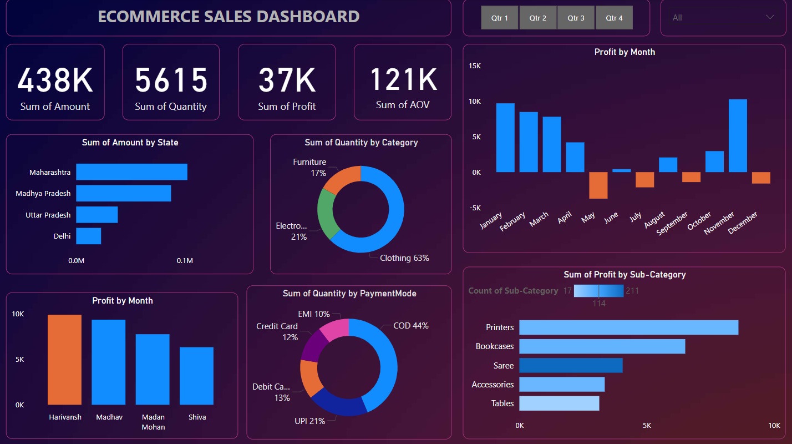

# 📊 E-Commerce Sales Analysis Dashboard (Power BI)

This project analyzes E-Commerce sales data using Microsoft Power BI and presents key insights through an interactive dashboard.

## 🔍 Overview
The dashboard includes:
- Total Sales and Revenue
- Top Selling Products
- Customer Segmentation
- Sales by Region & Date
- Interactive Filters & Slicers

## 📁 Files Included
- `Ecommerce_Sales_Analysis.pbix` — Main Power BI dashboard
- `sample-data/sales.csv` — Example data (if included)
- `screenshots/` — Preview of the dashboard

## 🛠 Tools Used
- Microsoft Power BI
- Power Query for data cleaning
- DAX for calculated columns and KPIs

## 📸 Screenshots

## 💡 Insights
- Most sales came from [Product Category]
- Sales peaked in [Month]
- [Add any key insight here]

## 📬 Contact
For any questions, reach me at [your email] or [LinkedIn profile]
